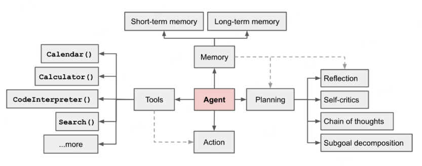
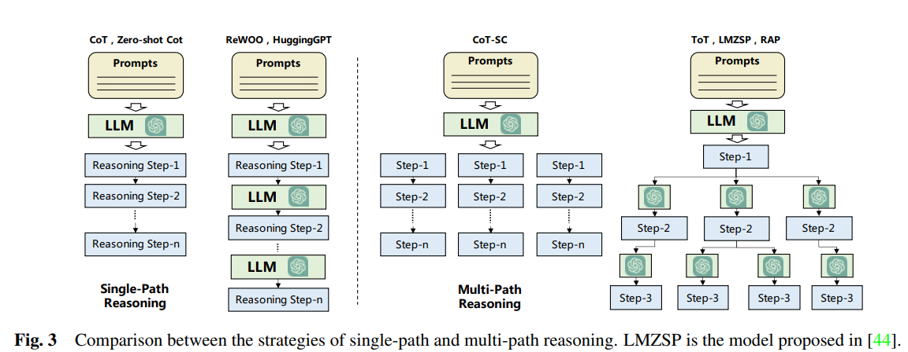

# 一 Agent介绍

Agent能够自主感知环境、做出决策、执行动作的智能体。

- 工具：LLM可以调用工具执行特定任务，例如查询天气。
- 记忆：在多轮交互、长期运行中，能够保留和利用过去的信息，而不是每次都“短时失忆”。在决策时不仅依赖输入，还能结合历史信息。其中记忆包括短期记忆、长期记忆和工作记忆
- 规划：将用户请求拆分成智能体能够单独解决的若干步骤或子任务。
- 行动：在规划下，利用记忆和工具，执行任务。

## 1.1 规划

让智能体根据目标自动制定行动计划，并按步骤调用工具、检索信息或生成内容以完成任务。

### 无反馈规划

无反馈规划在执行任务时 **一次性生成完整计划** 并执行，而不依赖执行过程中的中间反馈来调整步骤。常见的任务分解技术包括思路链 (Chain of Thought) 和思路树 (Tree of Thoughts)，它们分别代表了单路径推理和多路径推理（[Wang 等人，2023年](https://arxiv.org/abs/2308.11432)）

### 有反馈规划

智能体在执行任务时不断获取中间结果，根据反馈动态调整行动策略，以提高任务成功率和精度。

以 ReAct 为例，它将推理与行动结合起来，通过在思考（Thought）、行动（Action）和观察（Observation）这一系列步骤之间交替进行（重复 N 次），帮助大语言模型解决复杂任务。ReAct 通过观察形式从环境中获取反馈。其他反馈类型还可以包括人类和模型反馈

## 1.2 记忆

记录历史交互、任务状态或外部信息，使智能体能够在多轮交互或复杂任务中保持上下文连续性和决策一致性。在大语言模型智能体的研究文献中，主要区分为两种内存类型：

- **短期内存** - 涉及智能体当前状态的上下文信息，通常通过上下文内学习实现。由于上下文窗口的限制，这种内存是有时限和容量限制的。
- **长期内存** - 存储智能体过去的行为和思考，这部分信息需要在长时间内被保留并能够被回忆起来。通常通过连接至快速、可扩展的外部向量存储库来实现，以便在需要时为智能体提供相关信息。

## 1.3 工具

智能体调用的外部功能模块或 API，使其能够执行特定操作、获取数据或增强任务能力。
