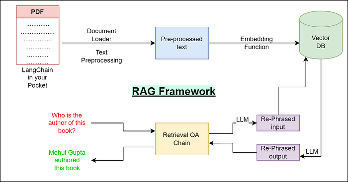

# 一  RAG 基本知识

RAG（Retrieval Augmentation Generation）代表了三个核心的行为：

- **检索（Retrieval）**：负责查询外部数据源，如知识库、API 或向量数据库。先进的检索器利用密集向量搜索和基于 Transformer 的模型来提高检索精度和语义相关性
- **增强（Augmentation）**：处理检索到的数据，提取和总结与查询上下文相关的最相关信息
- **生成（Generation）**：将检索到的信息与 LLM 的预训练知识结合起来，生成连贯、与上下文相符的回答

> 同时在三个核心动作之外，还有一个embedding-编码

RAG的处理流程如下图（[图片来源](https://medium.com/data-science-in-your-pocket/rag-framework-explained-and-faqs-d956ea0a6d16)）

处理流程： 

1. 查询理解：用户输入问题或者指令
2. 信息检索: 从知识库、向量数据库或文档集中找到与查询相关的内容
3. 信息融合：将检索的内容与用户输入合并，作为生成模型的上下文输入。
4. 内容生成：大模型基于增强后的上下文生成回答或者内容。

RAG有两个重要指标：

1. 召回率：匹配最相关的信息
2. 准确率：不相关的信息信息不要

> 在大语言模型 (LLMs) 的应用中，我们面临众多挑战，包括领域知识的缺乏、信息的准确性问题以及生成的虚假内容。检索增强生成 (RAG) 通过引入外部知识库等额外信息源，为这些问题提供了有效的缓解策略。

# 二 文档分块-chunking

文本分块的目的：

1. 克服上下文窗口限制
2. 提升检索的精度和效率

文本分块最核心在于如何权衡精度和上下文完整性。

## 2.1 固定分块大小 

按照固定的字符数或者token数来切割文本，例如chunk_size=100。适用于对文本结构要求低的简单场景。

优点：简单、高效，对文本格式无要求

缺点：语义不完整、上下文结构丢失

## 2.2 基于句子分块 

利用句子分割算法（如NLTK）将文本分割成独立的句子，将一个或多个连续的句子组成一个chunk。

优点：保持更好语义完整性。

缺点：句子长度差异大，影响检索；句子分割难度大，尤其是结构化文本效果差

## 2.3 递归字符分块 

递归字符分块是一种**智能分割策略**，来自 LangChain 的经典实现，其核心思想是：

> “**优先使用语义层次较高的分隔符**（如段落、句子、逗号），如果切分后仍太长，再使用更细粒度的分隔符递归继续切分。”

优点：保证语义结构完整性，适用性强

缺点：实现复杂，强烈依赖分隔符列表顺序。

## 2.4 基于文档结构分块 

**基于文档结构分块** 是一种利用文档的**语义层级或格式结构**来切分文本的技术。与纯字符递归切分不同，它会**理解文档的逻辑结构**（如标题、章节、列表、代码块等），并在语义上有意义的边界进行分块。

优点：保留原始结构，语义连贯性强

缺点：需明确文档的结构，保证完整正确的结构，难度大。

## 2.5 混合分块 

混合策略结合上述多种方法的优点，尝试获取更好的效果。例如先试用基于文档结构进行分割，然后在较大块的内容按照递归字符分块或者按照句子粒度进行细粒度切分。

优点：兼顾结构与大小限制，元数据丰富

缺点：复杂度高，策略选择

## 2.6 语义分块 

通过理解文本的语义内容（而非纯粹依赖字符、结构或标点）来切分文档，使每个分块都能代表一个完整的语义单元。常见方法包括基于句子向量相似度

优点：切分偏向语义，保证每个chunk内部高度相关

缺点：开销大、效果好坏完全依赖模型本身。

## 2.7 分层分块 

类似混合检索，但系统化创建多个层级chunks。例如将文本按照章节分成大块，再将每个章节按照段落分割成中块，最后按照句子分割成小块，不同层级的chunks可以被索引，用于不同的检索策略。适用于具有清晰层次结构的复杂文档（书籍、论文）等。

优点：提供不同粒度的上下文信息，增加检索的灵活性

缺点：增加索引的复杂度和存储空间

## 2.8 Small-to-Big检索/父文档检索器 

先用“小块”做检索 → 找到对应的“大块（父文档）” → 将完整父文档内容提供给生成模型。

优点：结构小块的检索精度和大块的上下文完整性。

缺点：需要维护小块和父块之间的映射关系，增加索引和检索逻辑的复杂度

## 2.9 命题分块 

**命题分块（Propositional Chunking）** 是一种基于文本语义逻辑单位进行分块的方法，目标是让每个块代表一个**完整命题（proposition）或独立陈述句**。一个命题通常包含主语、谓语、宾语。

优点：产生了非常细粒度、高度聚焦的知识单元，非常适合进行精确的事实检索和问答。

缺点：严重依赖 LLM 或 NLP 模型的抽取能力，可能产生错误或不完整的命题

## 2.10 Agentic/LLM-based chunking 

利用大语言模型（如 GPT、Claude、Gemini、DeepSeek 等）的语义理解与推理能力，对文档进行**智能语义驱动的动态分块**。

优点：潜力巨大，理论上可以实现最智能、最符合语义和上下文的分块

缺点：实现非常复杂，需要精巧的 Prompt Engineering 或 Agent 逻辑设计

# 三 索引增强 

## 3.1 语义增强 

语义增强是一种让模型超越字面匹配、理解文本真实含义并结合外部知识以提升理解和生成能力的技术。

语义增强主要类型：

- 表示层增强：通过改进文本的语义表示，让系统更好捕捉语义相似性。通常使用词向量/句向量，语义相似度。
- 知识层增强：引入外部知识来丰富语义理解，使模型具备“常识”或“事实”能力。如接入知识图谱、RAG等。
- 上下文增强：通过**历史对话、上下文、环境信息**增强语义理解。如引入记忆。
- 结构层增强：利用语义结构（如依存关系、语义角色）增强理解。

## 3.2 反向HyDE 

HyDE，Hypothetical Document Embeddings，是正向query检索增强的一种方式，不再由 query 生成“假设文档（Hypothetical Document）”去检索文档，而是**反过来从文档生成假设查询（Hypothetical Query）**来增强匹配。

# 四 Embedding检索

把文本转成语义向量，通过计算向量间相似度来找到语义最相关的内容。通常流程（更多信息见[向量检索](./3 向量检索.md )）：

1. 用 **Embedding 模型**（如 OpenAI `text-embedding-3-large`、BERT 等） 把文本、问题、文档都转成稠密向量。
2. 在查询时，也将用户输入转成向量。
3. 通过计算相似度（如余弦相似度）找到最接近的文档。

# 五 召回

## 5.1 倒排召回 

倒排索引（Inverted index）是文档检索系统中最常用的数据结构。离线索引构建时，通过分词器对文档进行切词，获得一系列关键词（term）集合，然后以 term 为 key 构建它与相关文档的映射关系。在线搜索中，通过切词器对用户输入进行切词，得到 term 列表，然后根据如下 BM25 打分公式进行打分排序返回给客户。

## 5.2 混合检索召回

目前常见的算法包括

1. Reciprocal Rank Fusion (RRF) ：为每路召回的结果列表中的每个文档都根据其排序位置分配一个分数，通常，得分是其排名的倒数。例如，排名第一的文档得分为 1，排名第二的得分为 0.5，排名第三的得分为 0.33，以此类推。那么最终文档的得分就是各路召回结果的累加。RRF 算法的好处在于鲁棒性，它的简单使得这种排序不容易过拟合，针对各种用户的不同场景无需大量参数调整就可以适应。
2. 简单权重加权融合，RRF 算法非常鲁棒，但它完全按照各路召回的排名进行打分，丢掉了原始召回中的相似度信息。在某些情况下，仍然需要进一步控制。
3. 基于外部模型的重排序，Infinity 原生支持基于ColBERT的重排序功能

检索的优点是可以在海量的知识里面快速找到和用户query相关的内容块docs，但是检索所返回出来的docs，实际上可能部分和用户query关联度并不大，这个时候就需要通过re-rank这一步，对于检索返回出来的docs做关联度排序，最终选取最相关的top k个doc，做后续的上下文补充。

在RAG链路中，ReRanking的常用技术是Cross-Encoder（交叉编码器），本质一个Bert模型（Encode-only的transformer架构），计算query和每一个doc相关性，返回0~1之间的结果（1代表最相关）

最后进行排序，选择top k个结果补充到context中，然后调用模型拿最后的结果。

# 六 重排 

在RAG（Retrieval-Augmented Generation）系统中，检索完成后进行重排序（reranking）的目的是为了提高最终生成结果的质量和相关性

## 6.1 倒数排序融合(RRF)

一种简单有效的数据融合算法，将多个来源、评分标准、各个不同的检索结果整合成统一的结果列表。

由于每路召回的评分标准不同，如何将多路召回的结果进行统一整理、排序是个非常困难的事情，RRF利用只关注文档在每个检索结果中的排名，不关心每路召回的分数，将所有结果统一起来，得到一个更加精确的排名。

## 6.2 Cross-Encoder Reranker

对 Query 与候选文档进行“逐对编码”，直接预测语义相关性，用于对初步检索结果进行精确重排序。核心思路：

1. **初步检索（First-stage retrieval）**
   - 先用 BM25 或稠密向量检索（Dense Retriever）召回 Top-k 文档。
2. **逐对评分（Cross-Encoding）**
   - 将 Query 和每个候选文档 **拼接**，输入同一个 Transformer 模型（如 BERT、ELECTRA、RoBERTa）。
   - 模型输出一个 **相关性分数**（通常是 0~1 或 logits）。
3. **重排序（Reranking）**
   - 按分数对初步检索结果重新排序，得到更精确的 Top-n 文档。

## 6.3 Graph-Based Rereanking

利用候选文档或句子之间的语义关系构建图，通过图算法重排序，以提升检索结果的整体相关性和一致性。核心思想

1. **初步检索**
   - 先用 BM25 或稠密向量检索召回 Top-k 文档或段落。
2. **图构建**
   - 将候选文档或句子视为图节点（Node）；
   - 节点间的边（Edge）表示语义相似度或引用关系，例如：
     - **余弦相似度**（Dense Embedding）
     - **共享关键词数量**（Sparse Vector）
     - **超链接/引用关系**
3. **图算法计算节点权重**
   - 常用算法：
     - **PageRank / Personalized PageRank**：衡量节点重要性
     - **HITS（Hub & Authority）**：计算节点权威度
     - **Graph Neural Networks（GNN）**：结合上下文进行特征学习
4. **重排序输出**
   - 根据图算法计算的节点分数对初步检索结果进行排序，优先返回语义更重要或更相关的文档。

## 6.4 ColBERT Reranker 

通过对 Query 和文档分词编码，再在向量级别进行逐项交互（Late Interaction），对候选文档进行高精度语义重排序。核心思想：

1. **双编码（Dual Encoder）**
   - Query 和文档各自通过 Transformer 编码为向量序列（每个词一个向量）
   - 与传统 Dense Retriever 一次编码整个文本不同，ColBERT 保留了 **每个 token 的向量**
2. **Late Interaction（后期交互）**
   - 不在编码阶段直接交互，而是在检索阶段对 Query 和文档 token 向量进行 **最大池化点积（MaxSim）**
   - 计算 Query token 与文档 token 之间的最大相似度，然后求和得到文档相关性分数
3. **精排（Reranking）**
   - 先用粗检索（BM25 或稠密向量检索）召回 Top-k 文档
   - 再用 ColBERT 对候选文档进行 Late Interaction 精排

