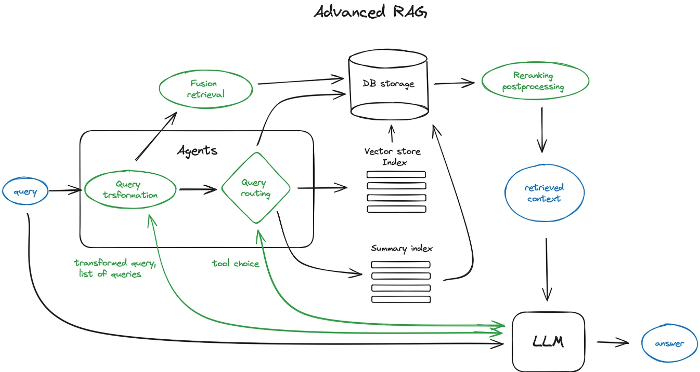
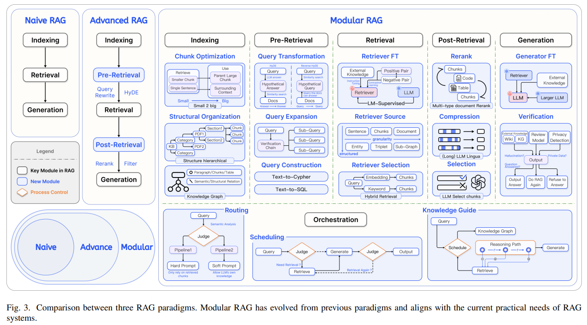
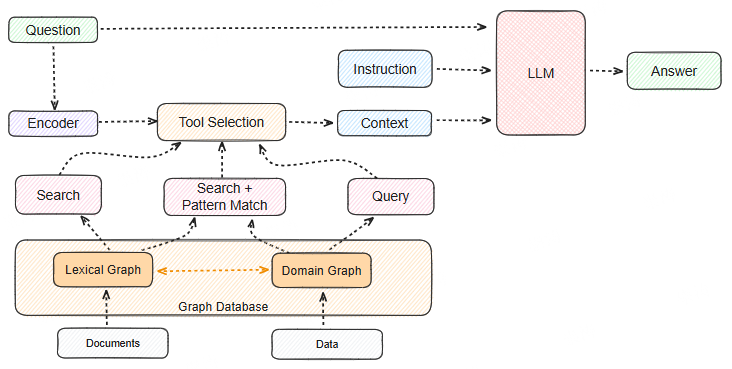
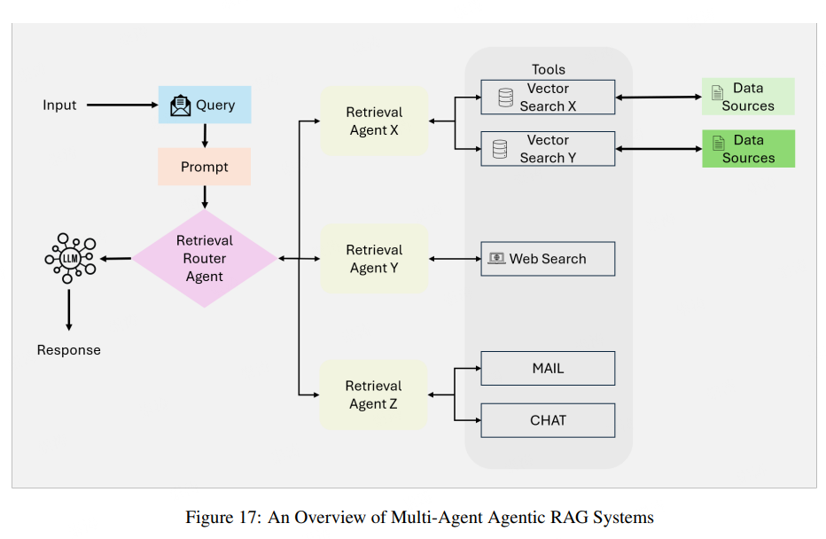

# 1 Naive RAG

在模型生成答案前，先从外部知识库中检索与问题相关的内容，再把这些内容和问题一起输入模型。其流程如下([图片来源](https://miro.medium.com/v2/resize:fit:4800/format:webp/0*Ko_ihY8ecAukf2g1.png))：

从上述可以，通常分为 4 个步骤：

1. **索引阶段（Indexing）**
   - 将知识库文档切分成小段（chunks），
   - 通过嵌入模型（Embedding Model）将每段转为向量，
   - 存入向量数据库（如 Milvus、Faiss、Pinecone、Elasticsearch/OpenSearch）。
2. **检索阶段（Retrieval）**
   - 用户输入 query，
   - 将 query 向量化，
   - 在向量库中检索与之最相似的若干文档片段。
3. **构建提示（Prompt Construction）**
   - 将检索到的内容拼接进提示模板
4. **生成阶段（Generation）**
   - 将完整 prompt 输入大模型，
   - 模型结合上下文生成答案。

其优点是实现简单，适用于基于事实的查询且上下文复杂性较低的任务。缺点是缺乏推理优化、无记忆、可扩展性等问题。

# 2 Advanced RAG

Advanced RAG在 Naïve RAG 的限制基础上进行了改进，通过融入语义理解和增强的检索技术，如下图所示（[图片来源](https://miro.medium.com/v2/resize:fit:2000/format:webp/0*Gr_JqzdpHu7enWG9.png)）。

主要集中三个方面：

1. 检索层：改进检索算法、增强语义匹配、多策略融合
2. 知识选择：上下文重新排序、上下文压缩
3. 生成层：推理、反思、验证

# 3 Modular RAG

**Modular RAG（模块化检索增强生成）** 是一种 **组件化、可插拔、可组合** 的 RAG 架构设计思想。它不是某种单一算法，而是一种 **系统架构范式（architectural paradigm）**。

> **核心理念**：把 RAG 的每个环节（检索、重排、上下文压缩、生成等）设计成独立模块，允许灵活组合、替换和优化，从而实现 **可维护、可扩展、可复用** 的知识增强系统。

处理流程如下图 ([图片来源](https://arxiv.org/pdf/2407.21059))：

# 4 Graph RAG

**Graph RAG（Graph-based Retrieval-Augmented Generation）**是一种在传统 RAG 基础上，引入 **知识图谱（Knowledge Graph, KG）** 或 **语义图（Semantic Graph）** 的增强型检索生成框架。

> **核心思想：**将知识以“图结构（nodes + edges）”组织起来，使模型能基于**关系与结构**检索信息，而不只是相似文本匹配。

处理流程如下（[图片来源](https://graphrag.com/concepts/intro-to-graphrag/)）:

Graph RAG的关键模块：

- 知识图谱构建：从知识库中抽取实体、关系，构建知识图谱
- 知识图谱存储：存储图的结构（节点、边、属性）
- 图检索：基于节点/关系检索子图
- 上下文生成：将检索到的节点、关系内容拼接为上下文

# 5 Agentic RAG

是在传统 RAG 框架上，加入 **自主决策（Agent Reasoning）** 和 **动态行动（Action Execution）** 能力的系统。

>  **RAG 是静态增强知识的模型**，**Agentic RAG 是动态利用知识的智能体。**

处理流程如下（[图片来源](https://arxiv.org/pdf/2501.09136)）

Agentic RAG 的关键特性包括：

- **自主决策**：代理根据查询的复杂性独立评估和管理检索策略
- **迭代改进**：引入反馈循环以提高检索准确性和响应相关性
- **工作流优化**：动态编排任务，实现实时应用的高效性

