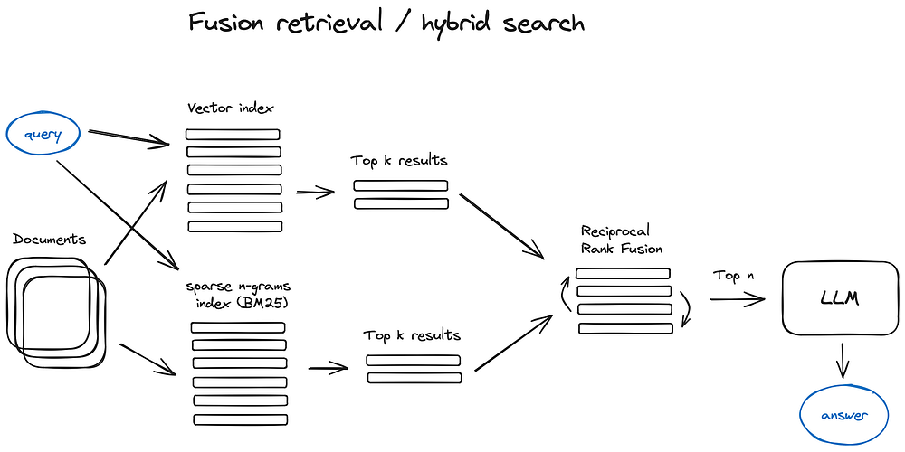

# 一 Embedding

**向量化** 是把文本、图像、音频等信息转换成数值向量的过程，使计算机能够在数学空间中理解、比较和计算“语义相似度”。

## 1.1 稀疏向量 

稀疏向量（Sparse Vector）是指一个向量中有大量的元素为零，仅有少量非零元素，例如，在一个1000维的向量中，如果只有10个元素非零，那么这个向量就是一个稀疏向量。

由于稀疏向量中大部分元素为零，直接存储所有元素会浪费大量内存。因此，稀疏向量通常使用**压缩存储**的方式，仅存储非零元素及其索引。常见的存储方法有以下几种：

1. **坐标形式**
   1. 存储非零元素的值和它们的位置（索引）
   2. 例如，向量[0, 0, 1, 0, 0, 2]
      - 非零值 [1, 2]
      - 索引 [2, 5]
2. 压缩稀疏行
   1. 适用于矩阵，但也可以用于向量
   2. 存储非零值、列索引和行的起始位置。
3. 字典形式
   1. 使用键值对存储非零元素的位置和值。
   2. 例如，向量 `[0, 0, 1, 0, 0, 2]`
      - 存储为 `{2: 1, 5: 3}`

例如bge模型在OpenSearch存储的结构是：

```json
{
    "98": 0.1693115234375,
    "5345": 0.2763671875,
    "15504": 0.22265625,
    "64287": 0.34912109375
  }
```

稀疏向量计算方式包括**向量加法**，**向量点积**和**矩阵与向量乘法**

1. **向量加法**
   1. 对两个稀疏向量的非零元素进行加法，忽略零元素。
   2. 例如，`[0, 3, 0, 5] + [1, 0, 0, 5] = [1, 3, 0, 10]`
2. **向量点积**
   1. 仅计算两个向量中索引相同且非零的元素，避免了对零元素的无意义操作。
3. **矩阵与向量乘法**
   1. 通过稀疏矩阵和稀疏向量优化计算，减少内存和时间开销。

## 2.2 稠密向量 

稠密向量是指向量中的大部分元素都为非零值。与稀疏向量不同，稠密向量直接存储所有元素，其数据结构更加紧凑。向量化的工具，可以使用开源或模型进行向量化。但在特定领域可能需要训练专门的向量化模型。

将输入的文本转换成向量，主要的过程包含文字到token的切分，每个token在词汇表中对应的id，每个token id都会对应等维度的向量

# 二 检索

## 2.1 稀疏向量检索 

**稀疏向量检索（Sparse Vector Retrieval）** 是一种基于 **稀疏向量表示** 的信息检索方式，它通过统计或语义特征（如词频、重要性）将文本映射为高维但大部分元素为零的向量，然后计算相似度来实现检索。常见的方法：

1. TF-IDF[词频-逆文档频率](../3 NLP/2 召回算法.md)

   基于词频和逆文档频率衡量关键词重要性；简单高效。

2. 基于统计的方案: [BM25](../3 NLP/2 召回算法.md)

   基于BM25的统计方案，无法引入更多的语义信息，并且无法引入上下文信息。但其实现起来比较简单，是稀疏向量检索中比较传统和初级的方案。 

3. 基于模型

   基于模型的方案，会通过模型来建模对应token下的重要度或者稠密向量，然后在进行检索时，通过跟token的匹配，进行匹配token的相似度计算，从而完成整个检索过程。但是会面临的一个问题是，一般doc的token数非常多，在建设向量索引的时候会存在明显的资源压力。


## 2.2 稠密向量检索 

**稠密向量检索（Dense Vector Retrieval）** 是一种基于 **语义相似度** 的信息检索方式，它通过深度模型将文本转换为低维稠密向量（embedding），再利用向量相似度来找出语义最接近的文档。

- 优点是：能理解同义、近义、语义关联表达，适合问答、对话、RAG、语义搜索。
- 缺点是：可解释性弱，训练与计算成本高。

## 2.3 Hybrid Search 检索

HyBrid Search，是一种强大的信息检索策略，它将两种或多种搜索技术结合到一种搜索算法中。通常，混合搜索结合了关键字搜索和语义搜索，利用了先进的机器学习技术。语义搜索根据文本的含义检索结果，而全文本搜索则侧重于精确的词语匹配。混合搜索对于对话查询以及用户不愿或无法输入精确关键字的“那叫什么？”之类的问题至关重要。

混合搜索结合了语义搜索和传统搜索的优势，提高了搜索的精度。混合搜索在兼顾语义理解和精确查询词的同时，可以提供改善用户搜索体验的结果。

